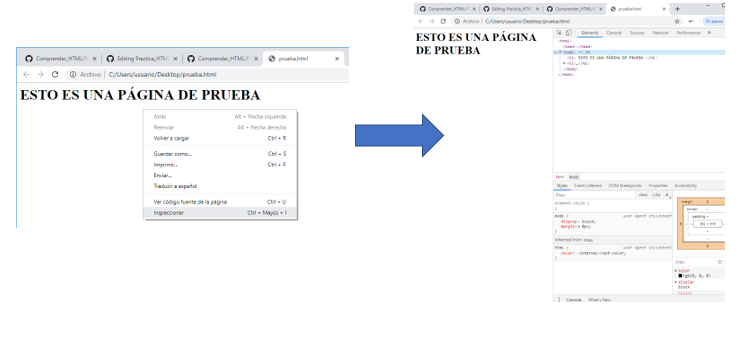
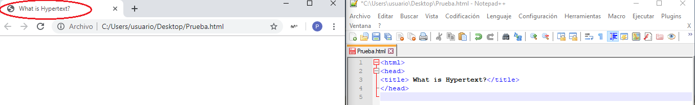
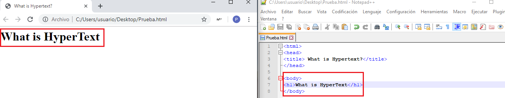
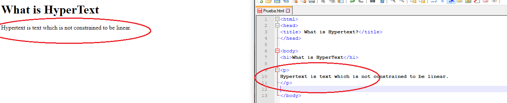
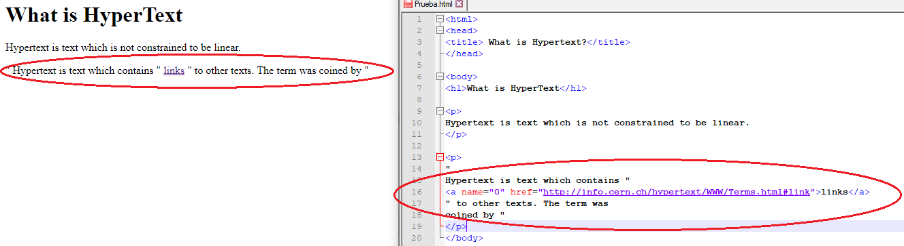
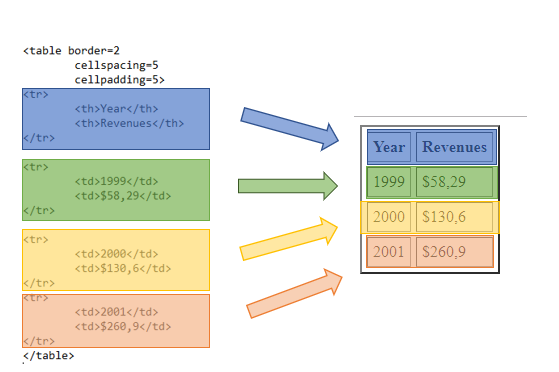
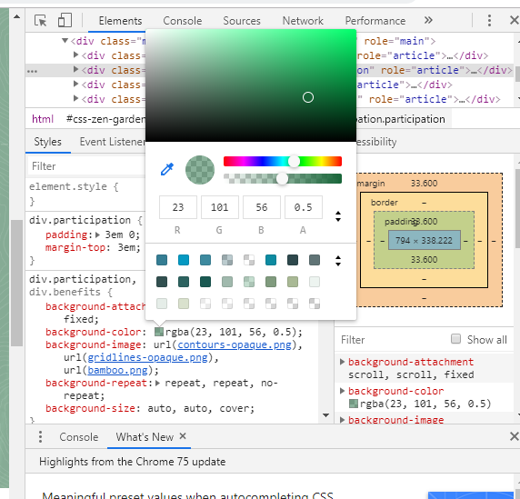
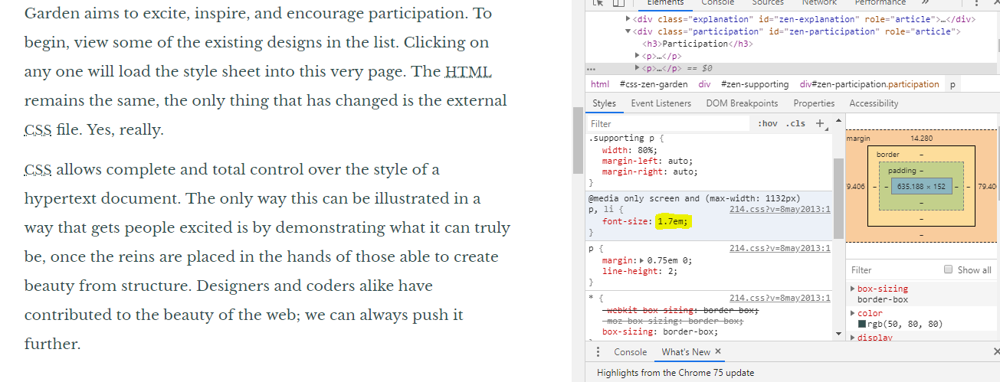

# COMPRENDER EL LENGUAJE HTML TRAS LAS PÁGINAS WEB

# Html
## Introducción
HTML (HyperText Markup Language) es el primer lenguaje que una persona debe conocer si desea comenzar a realizar páginas web. HTML no es un lenguaje de programación, sino un lenguaje descriptivo, una serie de etiquetas que el navegador interpretará de una u otra forma para mostrar distintos contenidos por pantalla.

Por tanto el HTML, es el lenguaje utilizado por el servidor para definir las páginas del WORLD WIDE WEB. El ejemplo más claro lo encontramos precisamente en la primera página creada en la WWW: [primera página web](http://info.cern.ch/hypertext/WWW/WhatIs.html). En está veremos cómo esta página web está compuesta por un simple fichero HTML que a día de hoy, nuestro navegador sigue siendo capaz de leer.

Los ficheros HTML son que pueden ser escritos con cualquier editor básico, tal como Notepad. En este fichero de texto se introducen unas marcas o caracteres de control llamadas TAGs, que son interpretadas por el navegador. Cuando éste lee un fichero con extensión *.htm* o *.html* interpreta estas TAGs y formatea el texto de acuerdo con ellas.

En conclusión, HTML es el lenguaje que nos sirve para crear páginas sencillas a través de una serie de TAGs que veremos a continuación:

## TAGs básicos

En primer lugar, abriremos la primera página web e iremos viendo paso por paso que indica cada comando del HTML.
Es importante saber que el lenguaje HTML es un lenguaje completamente anidado. Esto significa que existe una jerarquía dentro de los TAGS. Cada tag empieza cuando el usuario escribe <> y termina al poner </>.

Para leer el fichero .html que existe tras una página web, en nuestro caso tras la [primera página web]() , pulsaremos el botón derecho de nuestro ratón y clicaremos en la pestaña de *inspect*. Esto abrirá una ventana de comandos que analizaremos a continuación.

### HEAD
El operador head, da nombre a la pestaña que queremos crear. De esta manera, no creará nada en el documento más que el título de la misma en la parte superior del buscador. Véase el ejemplo:

Busque en la [primera página web](http://info.cern.ch/hypertext/WWW/WhatIs.html) el *head* correspondiente.

### BODY

El operador *body* da paso al cuerpo de la página web. Aquí escribiremos lo que deseamos que se vea en nuestra página.

El operador h a su vez, indica título (headline) y va ordenado desde el 1 hasta el 6. En este caso hemos establecido h1 como título. Véase el ejemplo:
 

 
Por otro lado, el operador p se emplea para definir un párrafo. Cuando queramos empezarlo emplearemos el comando p y terminarlo /p. Así el buscador representará los párrafos de manera automática.
 

Para incluir referencias a links crearemos un tag de la siguiente forma:

  
 
### Tablas
Para la creación de una página web, es imprescindible el empleo de tablas como veremos más adelante. Aunque la primera página web no incluya tablas veremos el siguiente ejemplo:
Para iniciar la tabla emplearemos el TAG *table* y en las primeras filas definiremos los espacios y bordes. Cada fila vendrá definida por el TAG *tr *. Después los títulos de la tabla se definirán mediante el TAG *th* y el contenido por *td*. Véase el ejemplo.

### Apendice

Esto es tan solo una formación básica en html. Existen miles de manera de programar y por tanto no merece la pena conocerlas todas. Todo programador puede acudir a páginas web como https://www.w3schools.com/html/ donde se exponen múltiples usos y ejemplos de diferentes TAGs. De esta manera el programador tan solo tiene que copiar el código y adaptarlo a sus necesidades.

# CSS

El css es una herramienta que permite configurar la visualización de las páginas web. En este curso tan solo la mencionaremos por encima pero para comprender su uso es importante resaltar que toda página web está organizada como si fuera una tabla. El Css es la herramienta que emplea el programdor para adaptar esta tabla a sus necesidades, variando el tamaño, espacio, color, etc  de cada caja. 

Para obtener una idea superficial, abriremos el siguiente link:

+ [CSS ZEN GARDEN](http://www.csszengarden.com/)

 Esta página web, nos muestra como trabaja el CSS. La página alberga un mismo fichero html, pero sin embargo el CSS ha cambiado la forma de exponerselo al usuario.
 

 
Clicando con el botón derecho, abriremos la pestaña de ispeccionar en el apartado que se desee dentro de la página del CSS Zen Garden. Una vez abierta la pestaña, para realizar la práctica de manera muy sencilla el alumno tan solo necesita hacer dos cambios:

+ cambie el color de una de las capas de la caja como se indica en la figura:

+ cambie el tamaño de letra como se indica en la figura:

